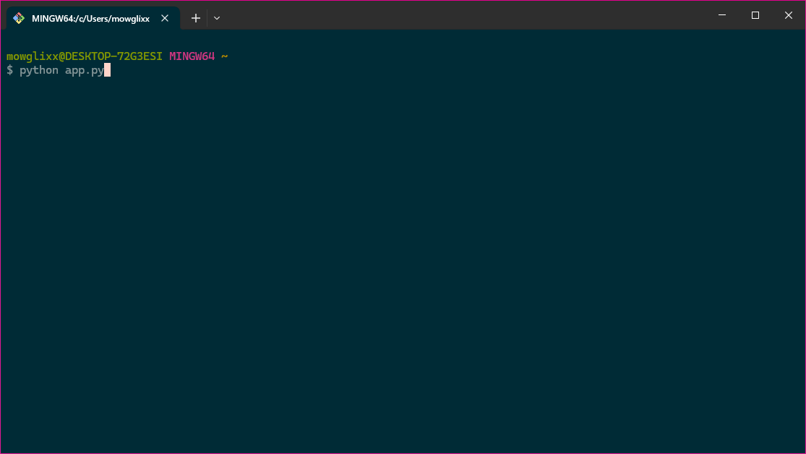

# python-learning
Python learning materials

## What is (a) ...?

This section is helpful to refer back to for terminology

### Python

`Python` is a program and, just like any other program on your computer, it can be run from a `terminal`.

### Terminal

A terminal is a way for you to interact with your computer with text, you can type `commands` into a terminal and you will be able to read the output.

(See [What terminal should I use?](TERMINALS.md))



Programs take `options` and `arguments`. 

`notepad` can open a `txt` file 

```sh
notepad.exe VeryImportantNotes.txt
```

`mspaint` can open a `jpeg` image.

```sh
mspaint.exe MyHolidayPhoto.jpg
```

`python` can open `py` scripts.

```sh
python app.py
```
