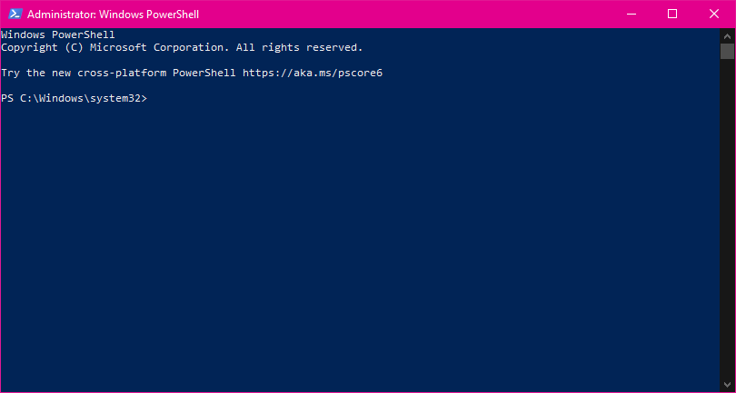
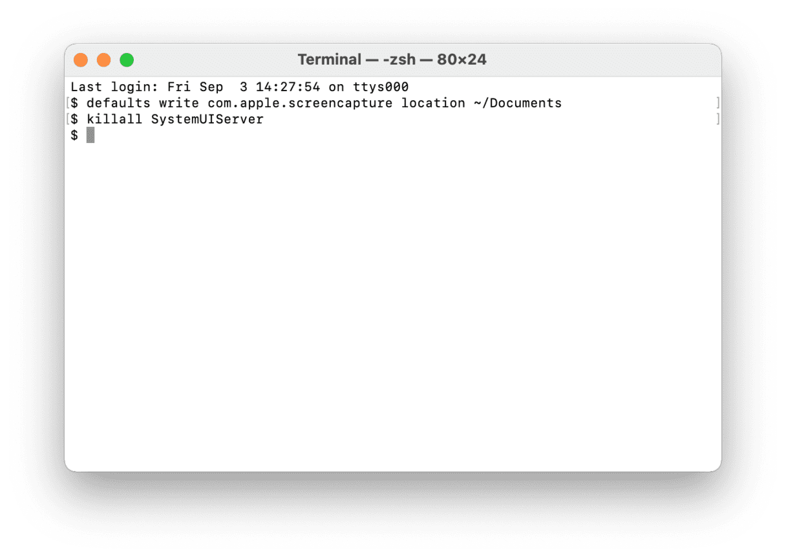
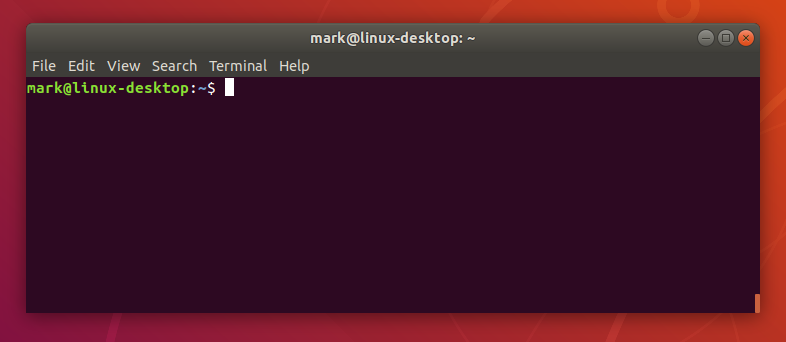

# Terminals

A terminal is a way for you to interact with your computer with text, you can type `commands` into a terminal and you will be able to read the output.

You can also run programs on the computer such as `dir` on Windows or `ls` on MacOS or Linux to list the 

## Windows

Windows has it's own terminal called `Command Prompt` / `cmd.exe` on older computers or `Windows Powershell`/`powershell.exe` on more recent versions.

Windows has stayed away from the `Bash` terminal for many years but you can install `Bash` a number of ways...

I recommend is that you download and install `Git Bash` from [here](https://gitforwindows.org/), this will set you up with `Git Bash` ready for if you decide to use `GitHub` to store your `Python` projects (also recommended), when you have installed `Git Bash` you may as well get `Windows Terminal` from the Windows Store.

## MacOS

You can use the built in `Terminal.app` to run a `zsh` terminal, this is similar to `Bash` and operates mostly the same.

## Linux

Most Linux distributions come with `Bash` and you can typically run a terminal window by searching your app list (if you have one), if you don't run a Desktop Environment with your Linux distribution then you should already be using a terminal... 

*You probably don't need to read this section if you're comfortable on Linux*

